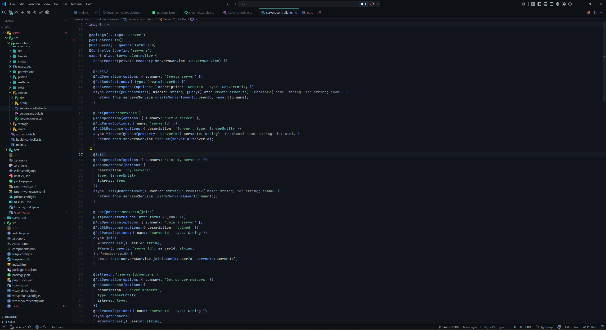
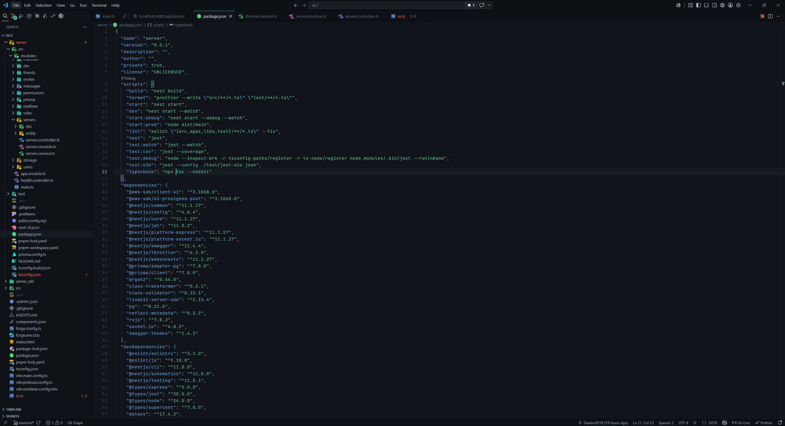
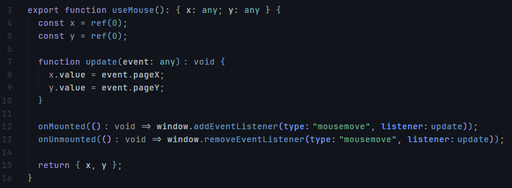
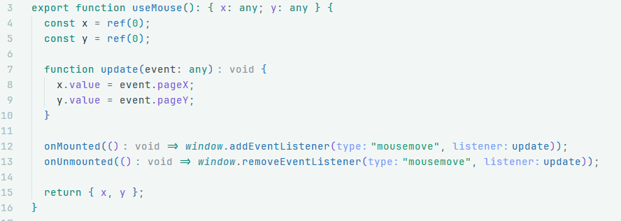
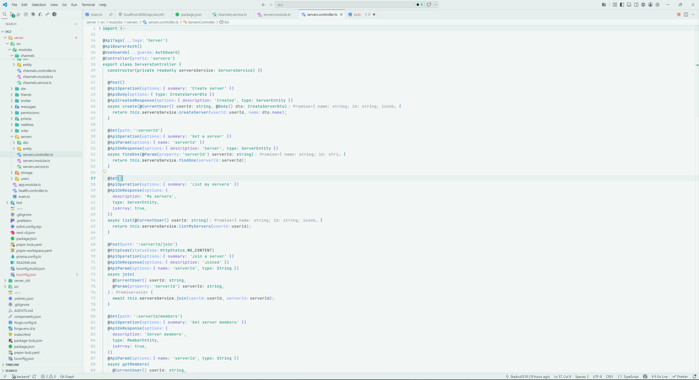
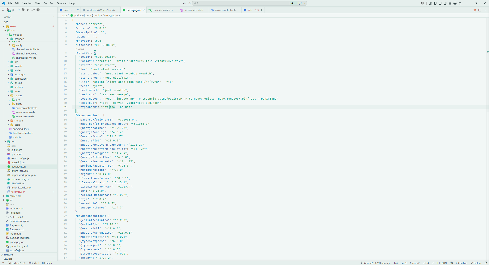

# Lagoon

Aesthetic cool teal-to-lavender VS Code theme with **Dark** and **Light** variants.

- **Lagoon Dark** — near-black cool background, lavender keywords, soft-blue functions, muted-green strings, whitish properties, dim variables. Tuned for low eye strain (low contrast).
- **Lagoon Light** — airy teal background, saturated tokens in the same hue family.

## Activate

`Ctrl+K Ctrl+T` → pick **Lagoon Dark** or **Lagoon Light**.

## Screenshots

### Dark

### Light

## Palette

| Token            | Dark      | Light     |
|------------------|-----------|-----------|
| Background       | `#11141A` | `#F2F7F6` |
| Keyword          | `#9B93C4` | `#0E8C7A` |
| `return` / flow  | `#63A98C` | `#0E8C7A` |
| Function         | `#6B9AC2` | `#2476B8` |
| Property / param | `#BCC4CD` | `#7C5CD4` |
| Variable         | `#8E94A6` | `#2A3B3E` |
| String           | `#69AE8F` | `#1E9E78` |
| Number           | `#63AC8E` | `#0E9E7E` |
| Comment          | `#5A6573` | `#8AA0A0` |

## License

MIT
